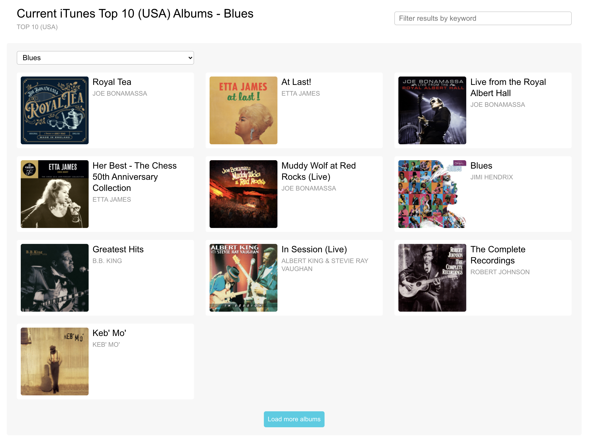

# Aulatunes React, Nodejs and TypeScript Application



## Building Docker Images

```shell script
docker-compose build
```

## Running Docker Application

```shell script
docker-compose up
```

## Running Front-End Application
[http://localhost:3004/](http://localhost:3004/)

## Back-End Service Test Scripts
```shell script
curl http://localhost:3002/aula/api/gettopalbums/limit=2/json

curl http://localhost:3002/aula/api/gettopalbums/limit=100/json

curl http://localhost:3002/aula/api/gettopsongs/limit=10/json
```